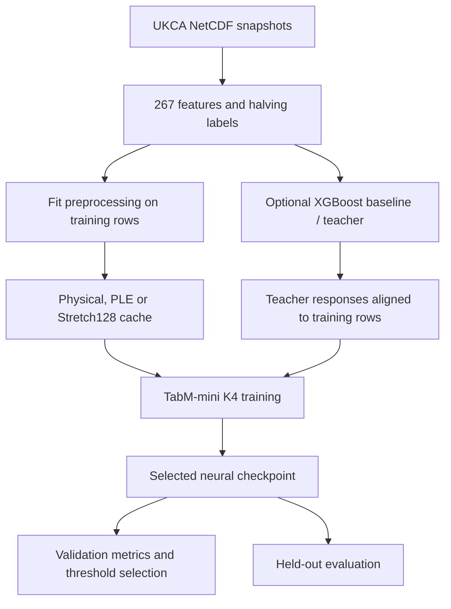

# MLStep: machine learning for UKCA chemistry timestepping

MLStep predicts how many times a UKCA chemistry timestep needs to be halved
from the atmospheric state in each grid box. The target is an integer from
**0 to 4**, corresponding to recorded `ncsteps` values of **1, 2, 4, 8 or 16**.
The longer-term aim is to reduce chemistry-solver work by predicting a useful
initial timestep.


## How the code works



1. **Load and validate inputs.** `data.py` reads named NetCDF variables, checks
   dimensions and values, flattens each grid into rows, and maps `ncsteps` to
   halving-count labels. The fixed feature schema keeps cache, teacher and model
   columns aligned.
2. **Fit preprocessing once.** `cache.py` fits transforms using training rows,
   applies the same state to validation, and writes reusable arrays. Choose
   physical scaling, physical scaling with piecewise-linear embeddings (PLE),
   or quantile stretching (Stretch128).
3. **Train a rare-event model.** `student.py` retains every positive example
   (at least one halving) and resamples negatives each epoch. The detector
   learns whether any halving is needed; a second head learns the count
   conditional on a positive event. Optional teacher responses add distillation
   losses without changing the model architecture.
4. **Select and evaluate.** Each epoch is evaluated on the full validation
   split. The selected checkpoint is saved at the end of training.
   `generalization.py` reports probability quality, exact-count errors and
   recall-based operating points, or evaluates the reserved timestep block.

### Neural architecture and probabilities

`model.py` combines four ensemble members with a shared `512 → 256` ReLU
backbone and dropout 0.05. Each member has trainable input scaling and its own
detector and four-class severity heads. PLE, when enabled, is shared before
inputs are expanded across members. This is the project's fixed adaptation
of TabM-mini; see the [TabM paper](https://arxiv.org/abs/2410.24210).

For member `k`, let `d_k = sigmoid(detector_logit_k)` and
`s_k = softmax(severity_logits_k)`. The five joint probabilities are:

```text
P(count = 0) = mean_k(1 - d_k)
P(count = c) = mean_k(d_k * s_k[c - 1]),  c = 1, 2, 3, 4
```

The implementation averages each member's joint probabilities. Its reported
conditional severity distribution is the averaged positive mass divided by
`P(count > 0)`. It does not independently average the two heads and multiply
them afterwards.

## Setup

Python 3.10+ is required. From this directory:

```sh
python -m venv .venv
. .venv/bin/activate
python -m pip install -e .
```

For the standalone baseline or teacher-target preparation:

```sh
python -m pip install -e '.[xgb]'
```

Dependencies are NumPy, PyTorch (2.3+), scikit-learn, xarray and netCDF4;
XGBoost (3.x) is optional. GPU use requires a CUDA-capable PyTorch installation
appropriate to the machine; GPU XGBoost also requires its CUDA-enabled build.
The portable Python package does not hardcode cluster account, module or
environment paths.
CPU works with the same commands by using `--device cpu`.

## Inputs and split

Use a directory of `<variable>_<timestep>.nc` files. Each file must contain the
matching variable. Scalars have named dimensions `(z, y, x)`, vectors
`(s, z, y, x)`; the loader transposes named dimensions into that order.
The supported grid is `(38, 72, 96)`. Rows are ordered by timestep, then z/y/x.

The fixed input order is:

| Group | Channels | Physical transform before standardisation |
|---|---:|---|
| `temp`, `pres`, `cloud_frac` | 3 | Identity |
| `qcl` | 1 | Scaled log1p |
| `cell_volume`, `stratflag` | 2 | Identity |
| `tracer` | 83 | Scaled log1p |
| `residual` | 83 | Scaled arcsinh |
| `photol_rates` | 60 | Scaled log1p |
| `wetrt` | 34 | Scaled log1p |
| `qcf` | 1 | Scaled log1p |

There are 267 columns. RHS is excluded. `ncsteps` values must be exactly
`1, 2, 4, 8, 16`, mapping to labels `0, 1, 2, 3, 4`. Nonfinite inputs and negative
QCF are rejected. The established physical transform clips negative values in
other log1p groups to zero. Species order, units, and pre-decision availability
must match the source dataset; the loader cannot establish these from shapes.

All CLI timestep ranges are **inclusive and explicit**. Discovery does not
silently discard the first available file. The internship residual experiments
used train `2:252`, validation `253:306`, and reserved evaluation `307:360`.
The filenames alone do not establish that another dataset represents the same
simulation or time period.

Set locations for your own machine; these are placeholders:

```sh
export RAW=/path/to/netcdf
export CACHE=/path/to/new/cache
export RUN=/path/to/new/supervised-run
```

The full training and validation feature arrays together occupy about **79.7 GiB**
in float32, before labels, preprocessing temporaries and training allocations.
Cache building saves and releases training arrays before loading validation; each
split still needs substantial host RAM. Neural training loads both full splits. XGBoost loads
sampled training rows one timestep at a time, but keeps the full validation
matrix during construction of its quantised representation.

## Prepare neural inputs

Embed all nonconstant continuous columns, with `stratflag` and constant columns
bypassing the embedding:

```sh
python -m mlstep.cache --data-dir "$RAW" --cache-dir "$CACHE" \
  --preprocess ple --train-timesteps 2:252 --validation-timesteps 253:306
```

To embed only selected groups, add `--embedding-groups tracer residual`.
Other groups still enter the backbone as physically transformed scalar inputs.
PLE uses 48 training-fitted quantile bins and 12 learned coordinates per embedded
feature. **No XGBoost ranking or teacher is involved in preparing neural inputs.**

For a nonzero-width PLE interval `[left, right]`, the encoding component is
`clip((x - left) / (right - left), 0, 1)`. Each feature's 48 components have a
learned linear projection to 12 coordinates. Repeated quantiles use a finite
step encoding. Bin boundaries are fixed from training inputs; the projection
weights are learned during neural training. Values outside the fitted range
saturate at the end bins.

Alternatively, use a separate new cache directory with `--preprocess physical`
(no embeddings) or `--preprocess stretch128` (physical transforms followed by
128-quantile stretching and standardisation; no embeddings). Stretch128 here
uses feature distributions, not label-aware bin widths.

A cache contains `train_x.npy`, `train_y.npy`, `val_x.npy`, `val_y.npy`,
`preprocessor_state.npz`, and compact `metadata.json`. PLE adds
`ple_metadata.npz`. `load_cache_state()` reads metadata, fitted preprocessing
and optional PLE settings together; large arrays are loaded separately.
Preprocessing and bin boundaries are fitted on training
rows only. Quantile fits use bounded deterministic training samples and retain full-training
minima and maxima as endpoints. Physical log/arcsinh scales use each raw column's
mean absolute nonzero value; mean/std standardisation follows the physical
transform (and stretching, where selected). Historical `ple64` artifacts are
not automatically converted.

If a physical cache already exists, PLE variants can reuse its arrays:

```sh
python -m mlstep.cache --physical-cache /path/to/existing/physical-cache \
  --cache-dir /path/to/new/ple-cache --preprocess ple \
  --embedding-groups tracer residual
```

This inherits the source data location and splits. It creates hard links for the
feature/label arrays and scalar preprocessing state, and fits separate PLE bins.
The caches must be on the same filesystem. Treat their contents as immutable:
editing a shared file in place changes every linked cache.

## Train the neural model

```sh
python -m mlstep.student --cache-dir "$CACHE" --output-dir "$RUN" \
  --device cuda --precision auto --seed 0
```

Both supervised and distilled runs use four TabM-mini members, a shared
`512 → 256` backbone, dropout 0.05, and detector plus conditional-severity
heads. Training keeps all positives and resamples up to 256 negatives per
positive each epoch, with a sampled-prior correction in the detector loss.
The supervised objective is detector BCE plus 0.1 times positive-only severity
cross-entropy. If `N_neg` is the population negative count and `n_neg` is the
sampled count, the detector BCE uses `logit + log(N_neg / n_neg)`. This correction
lets the unshifted prediction logit represent population odds despite negative
undersampling. It assumes uniform negative sampling and retention of all positives.

AdamW uses learning rate `1e-3`, weight decay `1e-4`, and gradient clipping at
norm 5. Defaults are 120 epochs, patience 12 and batch size 1024. Early stopping
minimises validation ranked probability score (RPS), breaks ties with negative
log likelihood (NLL), then with higher detection average precision (AP). The
best weights are restored before saving.

Outputs are `model_<preprocess>_seed<seed>.pt` and a compact `training.json`
record. No per-epoch report collection is generated. Keep the model with the
**exact cache used to train it**: fitted preprocessing is required for raw-data evaluation.
Cache, target and training output directories must be new; evaluation output
files must not already exist. This prevents accidental overwriting of results.

`--epochs`, `--patience`, `--batch-size`, and `--eval-batch-size` control runtime.
`--cache-residency host` keeps full feature arrays in host RAM; `auto` uses GPU
residency only if sufficient free memory is available. Sampled epoch rows are
staged on the training device, so the complete sampled epoch must also fit in
device memory; reducing minibatch size only reduces minibatch allocations.
Weights are saved after training ends, not after each epoch, and do not include
optimiser state for resuming an interrupted run.

### Mixed precision

`--precision auto` uses BF16 on supported CUDA GPUs, FP16 with gradient scaling
on other CUDA GPUs, and FP32 on CPU. Explicit choices are `fp32`, `bf16`, and
`fp16`; the last two require CUDA. PLE bin arithmetic, loss calculations and
probability calculations stay in float32. PLE processes features in blocks to
limit temporary allocations. Validation/evaluation default to batches of 4096;
reduce the batch size if device memory is insufficient. No speedup or accuracy
preservation has been measured for this dataset. The implementation follows
[PyTorch autocast/gradient-scaling guidance](https://docs.pytorch.org/docs/stable/notes/amp_examples.html).

## Standalone XGBoost and optional distillation

Train the teacher/baseline on **raw** inputs and the same split:

```sh
python -m mlstep.xgb train --data-dir "$RAW" \
  --output-dir /path/to/new/xgb-run --train-timesteps 2:252 \
  --validation-timesteps 253:306 --device cuda
```

Defaults retain all positives and up to 64 negatives per positive, use depth-4
histogram trees, and select the boosting round by full-validation detection AP.
Outputs are `model.ubj` and compact `validation.json`. Saved probabilities are
reported with negative-sampling prior correction. The model embeds feature,
split and sampling metadata; no separate teacher configuration file is needed.

Prepare reusable training targets, streaming one raw timestep at a time:

```sh
python -m mlstep.xgb targets --model /path/to/new/xgb-run/model.ubj \
  --cache-dir "$CACHE" --output-dir /path/to/new/teacher-targets
```

This creates `train_teacher.npy` and `metadata.json`. The five columns contain
a population-scale detector margin and four conditional severity probabilities.
Teacher/cache feature schemas, recorded raw-data directory, and train/validation
splits must agree; raw training labels are checked against cached labels.
Do not replace raw data in place after preparing a cache. These checks are
alignment checks, not content hashes or proof of scientific data validity.

Enable distillation by supplying the target directory:

```sh
python -m mlstep.student --cache-dir "$CACHE" \
  --output-dir /path/to/new/distilled-run --teacher-dir /path/to/new/teacher-targets \
  --device cuda --precision auto --alpha 1.0 --beta 0.05 --kd-temperature 1.0
```

The two supervised losses remain. `alpha` weights detector response BCE;
`beta` weights conditional-severity KL, gated by teacher positive probability.
Both use temperature scaling. `--beta 0` gives detector-only distillation.
Omitting `--teacher-dir` gives standalone supervised training with no teacher
loading. Both modes save the same model architecture and use the same evaluation commands.
These KD weights are starting settings, not a demonstrated improvement over
supervised training on this dataset. XGBoost is not needed during neural evaluation.

## Offline evaluation

The package includes training and offline evaluation, with no standalone
prediction wrapper or production inference implementation. FTorch export and
UKCA integration remain separate follow-on work. Evaluation still runs batched
PyTorch forward passes to select epochs and measure model quality.

The threshold policy predicts zero below a detector threshold and chooses the
most probable positive severity above it. Joint argmax and threshold policies
have different error trade-offs; neither has been selected through solver tests.

Validation scores, exact-count confusion/under-/overprediction metrics, and
caller-supplied recall operating points:

```sh
python -m mlstep.generalization operating-points \
  --model "$RUN/model_ple_seed0.pt" --cache-dir "$CACHE" \
  --recalls 0.90 0.95 0.99 --output /path/to/new/validation.json --device cuda
```

The separate `locked` command evaluates exactly t307–360 and checks that those
timesteps were excluded from cache fitting:

```sh
python -m mlstep.generalization locked \
  --model "$RUN/model_ple_seed0.pt" --cache-dir "$CACHE" --data-dir "$RAW" \
  --output /path/to/new/held-out.json --device cuda
```

Add `--threshold VALUE` only for a policy selected beforehand. Both commands
accept `--precision`. They write compact metrics rather than plot dashboards.
A non-overlapping split check cannot establish that nobody previously inspected
those labels; confirm their evaluation status before using this period.

## Source map

| File | Responsibility |
|---|---|
| [data.py](mlstep/data.py) | Feature schema, NetCDF loading, labels, physical/Stretch preprocessing and sampling utilities. |
| [cache.py](mlstep/cache.py) | Training-fitted cache creation, cache validation, PLE selection and quantile bins. |
| [embeddings.py](mlstep/embeddings.py) | Piecewise-linear feature encoding and learned per-feature projections. |
| [tabm.py](mlstep/tabm.py) | Member input scaling, shared MLP backbone and member-specific linear heads. |
| [model.py](mlstep/model.py) | Fixed K4 architecture, joint probabilities and checkpoint save/load. |
| [student.py](mlstep/student.py) | Supervised and distilled training, resampling, losses and epoch selection. |
| [precision.py](mlstep/precision.py) | CPU/CUDA validation and shared FP32/BF16/FP16 selection. |
| [xgb.py](mlstep/xgb.py) | Raw-feature XGBoost training, prior correction and aligned teacher targets. |
| [evaluation.py](mlstep/evaluation.py) | Batched predictions, probability metrics, confusion counts and threshold policies. |
| [generalization.py](mlstep/generalization.py) | Validation operating points and fixed t307–360 evaluation. |
| [pyproject.toml](pyproject.toml) | Package metadata and required/optional dependencies. |

## AI assistance acknowledgement

ChatGPT was used to assist with code cleanup and documentation. The author
remains responsible for the code, scientific interpretation and any errors.

## Future work

The following are research proposals, not implemented capabilities or claimed
improvements. Keep the present supervised model and XGBoost as controls, compare
on chronological development data at natural class prevalence, and reserve the
final period for a frozen model and decision policy.

1. **Evaluate a stronger offline teacher.** Pilot a pretrained tabular model
   such as [TabICLv2](https://arxiv.org/abs/2602.11139) with a bounded training
   context, measuring prediction quality and memory/runtime before generating
   targets at full scale. If it improves on the controls, test whether a small
   student retains the gain. Use time-blocked out-of-fold targets within the
   training period so query labels are absent from teacher contexts. A new
   adapter must produce the existing population-logit plus conditional-severity
   target format and account for altered class priors. The current target
   generator supports XGBoost only.
2. **Make preprocessing label-informed.** Compare the existing unsupervised
   Stretch128 with the supervised transformation proposed in
   [Tabular Numeric Stretch Transformation](https://arxiv.org/abs/2608.09162).
   Start with a bounded fit subset: a direct pairwise kernel implementation can
   be costly at this scale. An alternative is label-informed PLE boundaries
   chosen by per-feature decision trees, as discussed in the
   [numerical-embeddings paper](https://arxiv.org/abs/2203.05556). Fit all
   label-dependent transforms inside training folds and keep the backbone fixed
   to isolate their effect.
3. **Improve pre-decision information and rare-event coverage.** Investigate
   available solver history, previous accepted step size or cheap stiffness
   indicators. Confirm when each feature is available and its extraction cost.
   Collect additional valid simulations for severe halving events; duplicating
   rare rows does not provide evidence about new chemistry regimes. Evaluate
   on later time blocks and new regimes.
4. **Choose policies using measured solver cost.** Compare calibrated detector
   thresholds and under-/over-halving trade-offs using recorded-case replay.
   Then integrate a frozen proposal with the solver's acceptance checks and
   fallback, measuring complete trajectories and chemistry error. Learning
   timestep decisions directly is a later possibility; the
   [reinforcement-learning timestepping paper](https://arxiv.org/abs/2104.03562)
   offers related methodology, without establishing suitability for UKCA.


## Papers and further reading

The first four papers underpin the implemented model families and training
ideas. The remaining papers motivate future experiments; their benchmark
results are not evidence of UKCA performance.

1. Gorishniy, Kotelnikov and Babenko. **TabM: Advancing Tabular Deep Learning with
   Parameter-Efficient Ensembling.** ICLR 2025.
   [Paper](https://arxiv.org/abs/2410.24210) — shared-parameter neural ensembles
   and the TabM-mini architecture used as the basis of this model.
2. Gorishniy, Rubachev and Babenko. **On Embeddings for Numerical Features in
   Tabular Deep Learning.** NeurIPS 2022.
   [Paper](https://arxiv.org/abs/2203.05556) — numerical embeddings, including
   piecewise-linear encodings and label-informed binning.
3. Chen and Guestrin. **XGBoost: A Scalable Tree Boosting System.** KDD 2016.
   [Paper](https://arxiv.org/abs/1603.02754) — the gradient-boosted tree baseline
   and teacher model family.
4. Hinton, Vinyals and Dean. **Distilling the Knowledge in a Neural Network.**
   2015. [Paper](https://arxiv.org/abs/1503.02531) — teacher/student training
   with soft targets and temperature scaling; this repository adapts those
   ideas to separate detection and conditional severity losses.
5. Qu et al. **TabICLv2: A better, faster, scalable, and open tabular foundation
   model.** ICML 2026. [Paper](https://arxiv.org/abs/2602.11139) — a candidate
   offline teacher for a future distillation experiment.
6. Ye et al. **Tabular Numeric Stretch Transformation.** 2026 preprint.
   [Paper](https://arxiv.org/abs/2608.09162) — target-informed feature stretching;
   the current `stretch128` implementation uses input quantiles without labels.
7. Dellnitz et al. **Efficient time stepping for numerical integration using
   reinforcement learning.** 2021 preprint.
   [Paper](https://arxiv.org/abs/2104.03562) — related work on learning timestep
   choices within numerical integration.
